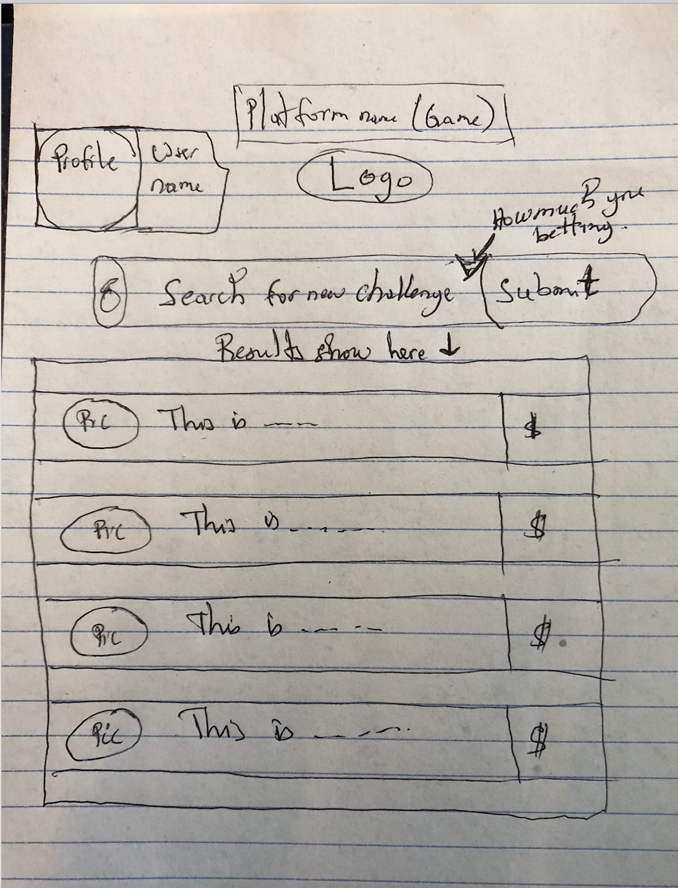

# prescript-playground
Description:
This is a game intended to be used on the Ethereum blockchain. The way it works would actually be similar to Kittykitten without kittens but coins only. 
Using purescript and possibly other language such as nodejs or solidity, it will allow the user to conduct a search and bet a list of adversairs he would want to challenge. The user will then either gain or loose his bet costing him his bet.

#header:
# This is an <h1> tag
## This is an <h2> tag
###### This is an <h6> tag

#List of features:

- [x] @mentions, #refs, [links](), **formatting**, and <del>tags</del> supported
- [x] list syntax required (any unordered or ordered list supported)
- [x] this is a complete item
- [ ] this is an incomplete item

